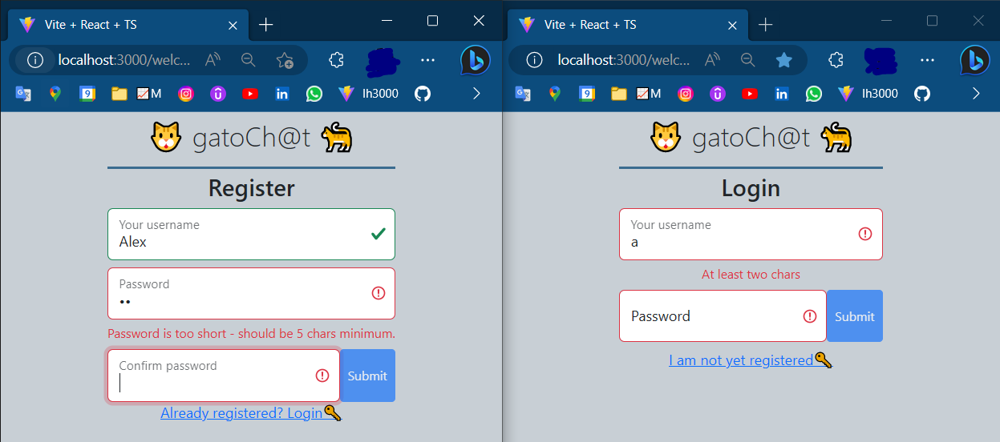
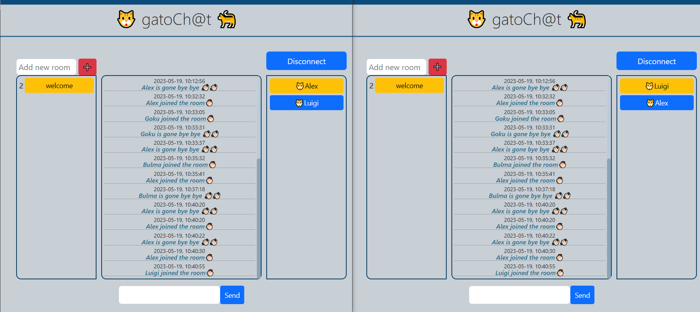
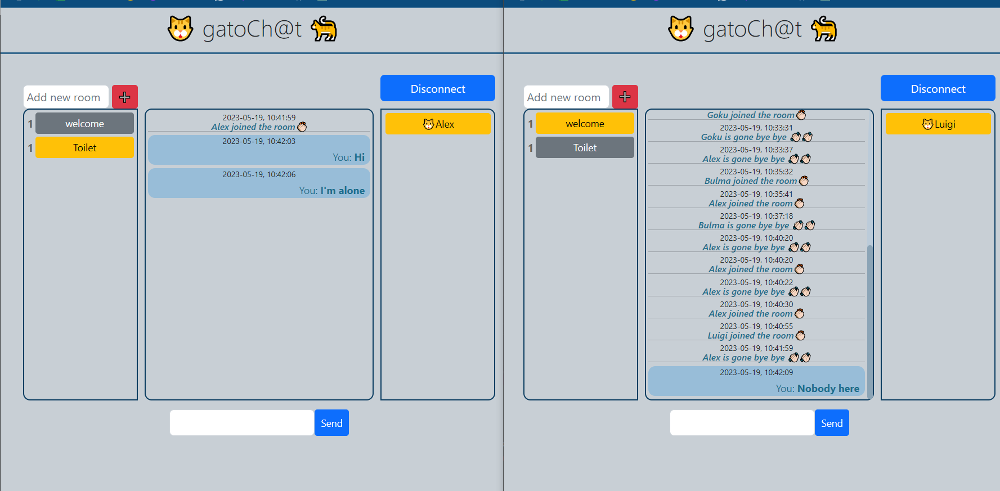
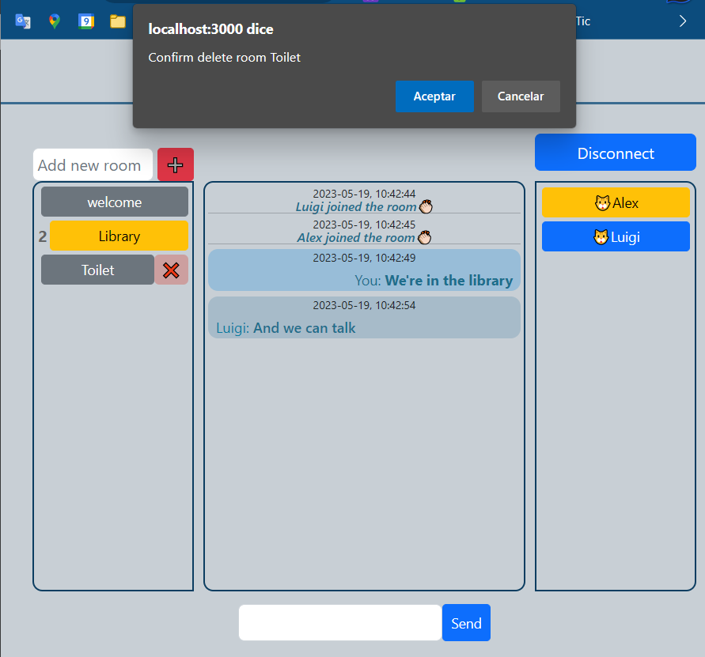

# Chat-WebApp 💻🖥

This project is a web chat that uses SocketIO to allow communication between connected users. Tha app uses ReactJS with Vite for the frontend and NodeJS with Express for the backend. All backed with a Mysql database.

## Personal notes 📝🙍🏻‍♂️

This project constitutes the end project of a Backend Nodejs bootcamp that I did at the Barcelona Cibern@rium (https://cibernarium.barcelonactiva.cat/). This project allowed me to throw myself into the pool and try many different technologies, almost entirely in Typescript, which at the time of making was rather new to me. I would lie If I said that I didn't struggle. Every technology gave me its own headaches. Some comments and a few difficulties I had:

- I struggled setting up the sequelize models in typescript. To the point I decided to allow these files in javascript.
- Manage routing in react, since react-router had significant changes from v5 to v6. Eventually I manage to have a working routing system that redirects the user to certain pages depending on the state of the app. For instance, if a user is not logged he/she cannot go into a chat room.
- Setup the first 'connection' event emitters and listeners in the socket context to connect at the start and listen for the socketIO server reply and update the context accordingly.
- Decide where and how to set the event emitters and listeners in the react frontend. Ended up using several useEffect hooks for each necessity and grouping them in the welcomeChat, father component, instead of placing them in each child component.
- I placed quite a few of useStates (e.g. for rooms, messages, loggedUser etc.). At some point I wasn't sure about what to store in the React context, so the app has a mix of both. At some point I even realized I was updating the context state even if I wasn't really using some context variables anywhere in the frontend. Anyway, I think it was beneficial for learning purposes but I'm sure there are better practices to apply regarding context management in React.
- Combining Bootstrap styling with Formik and Yup validation on client side.
- I big wall I hit was the fact that as users created and joined different chat rooms, messages started being sent everywhere and where no longer segregated to the room they where created in. I thought I could solve this by filtering on the client side by the message roomName but it didn't work out. What did the trick was to use additional socketIO functionalities on server side like **.join(roomName)**, **.leave(roomName)** and **.to(roomName)** to be more precise about where the users are connected and where should the messages be targetted from the server side.
- JSON web token is used to authorize users once they're logged in. User token is then verified over and again once a user tries either to create a room, either to join an existing room. If the token is not valid, the user is redirected to the login page.

## Working principles of this chat 📝

The chat is a web application that allows users to create rooms and chat with other users in real time.

- First users must register. Usernames must be unique, so any attempt to register with an already existing username will be rejected with a simple browser alert message displayed.<br/>
  <br/>
- Users can switch between login and register forms by clicking on the 'login' or 'register' links. If a user tries to login with a non-existing username, a simple browser alert message will be displayed.
- After registering/login, users are redirected to the welcome chat where the input msg is autofocused (a nice touch I believe :) and they can start chatting with other users in that room.<br/>
  <br/>
- Users can create new **public** rooms by writting a name in the newRoom input above the room list.<br/>
- If a user clicks on another connected user on the right side list, a new **private** room will be created, allowing only the clicked user and the current user to see it, talk in it and delete it.
  <br/>
- A user can ONLY BE AT ONE ROOM AT A TIME. Meaning, once he/she goes to a different room, it will be socket-disconnected from the previous one, and socket-joined to the next one.
- Rooms can be deleted (except the welcome room) as long as they're empty of users.<br/>
  <br/>
- Finally, users can disconnect by clicking the disconnect button on the top left of the app grid or simply close the browser window which triggers a javascript beforeunload event that emmits a disconnection request to the socket server.
  </br><hr>

**Some of the things the app doesn't do** (at least for now)**:**

- _Create private rooms with more than 2 users._
- _No notifications or mentions of any kind are sent or highlighted to the users. You just see rooms being created/deleted and messages appearing in front of you._
- _Send files or pictures._
- _Delete neither rooms that contain users nor the 'welcome' room in any case._ </br>

## Installation 📦

- Clone the repository on your local machine using the command git clone.
- Open two terminals to be able to execute client and server side at the same time.
- On terminal 1 setup the frontend:

```
cd client
npm i
npm run dev
```

- On terminal 2 install backend dependencies:

```
cd server
npm i
```

- On server side, create a config.env file if not exists inside the /config folder. It will contain the environment variables that you need to set up for the databse in order \* to run the server. You can use the _config.env-template_ file as a template.
- Make sure you fill correctly the variables in the config.env file, otherwise the server won't run. Put a correct mysql username (MYSQL_USER) and password \* (MYSQL_PWD), and a correct database name (MYSQL_NAME). You can change the PORT if you want.
- **npm start** to run the backend. This will create the database and the tables if they don't exist already. You can check that in the mysql workbench.
- Open http://localhost:3000/ in your browser.
- Have fun🎊🎉 cat lovers🐈.

## API routes check with Postman 📡

- You can try the 3 existing API routes in the backend server logic:register, login and tokeninfo.
- Just click on the following link and then click on the 'Run in Postman' button. It will open the Postman app and you'll be able to fork the Postman collection and try the routes with modified JSON body inputs. <br>
  [](https://app.getpostman.com/run-collection/25968116-5c72061e-c1c8-4454-b8bc-119dc0532a50?action=collection%2Ffork&collection-url=entityId%3D25968116-5c72061e-c1c8-4454-b8bc-119dc0532a50%26entityType%3Dcollection%26workspaceId%3D57d04225-0c95-4842-86b9-1798df87390b)

## Improvement opportunities 📈

Although I believe I've achieved the desired functional result and fulfilled most of the bootcamp requirements, there is significant room for improvement for this app. To mention a few potential improvements:

- First and foremost, add password recovery functionality.
- JSON web token implementation is a bit trivial and superficial. Users are assigned a token at login/register and then it is stored in the local storage, which is not the most secure practice. I'm still learning how to implement a more robust authentication system. Another important feature would be to add token verification at first connection. If the user's localhost keeps the token after leaving the page, then when returning to the chat page he/she could be automatically logged in. I'm actually working on it on a separate project branch.
- Client side code needs to be more encapsulated. For example all API requests should be in a services directory.
- Ideally, the sequelize models shouls be implemented in typescript, just like the rest of the project.
- Implement a more robust error handling. Mine here is still quite basic with browser alerts.
- Study the implementation of hexagonal architecture. At least in the backend. I only scratched the surface by having an infrastructure of database repositories. These are charged with the CRUD operation on the databse. These allows the controllers and listeners to be db agnostic.
- It could be a nice feature to add deleteRooms with users inside and redirect them all somewhere else. Also, the fact that any user can delete any room is not the best practice. Ideally, only the creator of the room should be able to delete it (for example).
- Users don't have a profile picture nor can send files or pictures. Multer could be used to implement this feature.
- Also, once registered, users are permanently stored on the db. It would be nice to implement a feature so users can delete their accounts.</br>
- The app should be dockerized. I'm still learning how to use docker and docker-compose.

## Languages and Technologies 👦•💻


### Backend stack


### Databases and ORM


### Frontend stack


